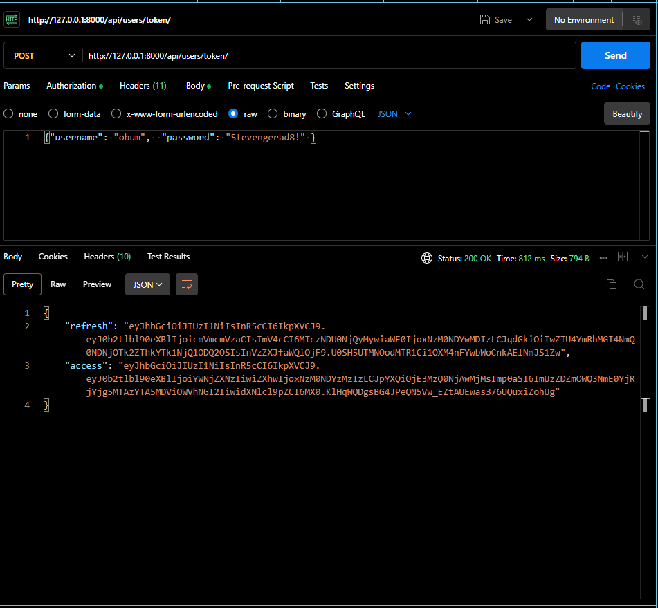

# Inventory_Management_Sys_API

Develope an API to manage inventory for a store where authenticated users can add, update, and delete inventory items, and view inventory levels.

---

## Project Blueprint

1. [Dependencies] (#Installation and Dependencies)

2. [Authentication] (# Setting up user authentication)

3. [Features] (#features)

- User authentication and JWT token support.
- CRUD operations for managing inventory.
- Secure API with token-based authentication.
- Detailed error handling and validation.

4.[Endpoints] (#endpoints)

    >  POST api/users/token/ : Authenticate user and issue a token.
    >  POST api/users/register/ : Register new users by providing their details.
    >  GET api/users/profile/ : To retrieve a user profile (Authentication required)
    > GET api/users/ : List all users. (Admin only)
    > POST api/users/ : Add a new user. (Admin only)
    > GET api/users/{id}/ : Retrieve details of a specific user. (Admin only)
    > PUT/PATCH api/users/{id}/ : Update user details. (Admin only)
    > DELETE api/users/{id}/ : Delete a specific user. (Admin only)
5.[Usage] (#usage)

---

---

- [Dependencies] (#Installation and Dependencies)

---

- [Authentication] (# Setting up user authentication)

1. Set up project dependencies
    > `django-admin startproject ims_api`
    > `cd ims_api`
    > `python manage.py startapp users`
2. Include the application to the *INSTALL_APPS* variable in the *setting.py* file.
3. Install the packages required for user authentication. eg JWT Authentication
    > `pip install rest_framework`
    > `pip install rest_framework-simplejwt`
4. include the installed packages in the *INSTALLED APPS* variable.

    ```python
        INSTALLED_APPS = [
            'rest_framework',
            'rest_framework_simplejwt',
            'Users.apps.UsersConfig',
            ]
        REST_FRAMWORK = {
            'DEFAULT_AUTHENTICATION_CLASSES':(
                'rest_framework_simplejwt.authentication.JWTAuthentication',
            ),
        }
        # SIMPLE JWT Settings (Optional Customization)
        from datetime import timedelta

        SIMPLE_JWT = {
            'ACCESS_TOKEN_LIFETIME': timedelta(minutes=5),
            'REFRESH_TOKEN_LIFETIME': timedelta(days=1),
            'AUTH_HEADER_TYPES': ('Bearer',),
        }

        # Set up the built-in token retrieval views in the urls.py file
        from rest_framework_simplejwt.views import TokenObtainPairView, TokenRefreshView
        from django.urls import path

        urlpatterns = [
            path('api/token/', TokenObtainPairView.as_view(), name='token_obtain_pair'), 
            path('api/token/refresh/', TokenRefreshView.as_view(), name='token_refresh'),
            ] # This allows users to obtain a new token by providing their username and password.
    ```

5. Set up User model / serializer / views/ url

---

## POSTMAN ScreenShot



  ---

## Previous Project Github Repo

 https://github.com/obum/Alx_DjangoLearnLab.git
